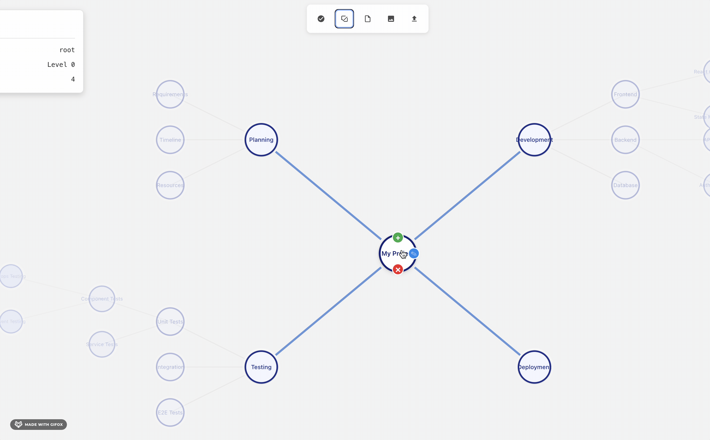

# ThoughtNet

A visual tool for studying complex topics by connecting related concepts into coherent knowledge networks.



## Overview

ThoughtNet helps students and researchers organize interconnected topics into visual networks. Create nodes for concepts, connect related ideas, and build comprehensive understanding of complex subjects.

**Key Benefits:**
- Offline-first: Works entirely in your browser with local storage
- Visual connections: See relationships between topics clearly  
- Search and navigate: Find concepts quickly in large networks
- Export/import: Save and share your knowledge maps

## Getting Started

### Installation
```bash
git clone https://github.com/gregdbanks/mind-map.git
cd mind-map
npm install && npm run dev
```

### Basic Usage
1. Click "Load Demo Map" to see an example network
2. Create new nodes by hovering over existing nodes and clicking "+"
3. Double-click nodes to edit text and change colors
4. Use Ctrl+F to search for concepts
5. Spacebar + drag to pan around large networks

## Features

- **Visual Organization**: Automatic radial layout with manual positioning
- **Search**: Fuzzy search with instant navigation to concepts
- **Color Coding**: Organize topics with custom node colors
- **Keyboard Navigation**: Ctrl+F search, F2 edit, spacebar pan
- **Data Persistence**: Auto-save with export/import capabilities
- **No Registration**: Start immediately, no accounts required

## Development

### Testing
```bash
npm test          # Interactive test mode
npm run test:ci   # Full test suite
npm run test:e2e  # End-to-end tests
npm run typecheck # TypeScript validation
```

**Test Coverage**: 126/126 tests passing (100% success rate)
- See [TEST_STRATEGY.md](TEST_STRATEGY.md) for detailed testing information

### Building
```bash
npm run build     # Production build
npm run preview   # Preview production build
```

### CI/CD Pipeline

The project includes a comprehensive GitHub Actions pipeline that automatically:

**On Pull Requests:**
- Runs TypeScript type checking
- Executes full unit test suite (126 tests)
- Runs end-to-end tests with Playwright
- Tests on Node.js 18.x and 20.x
- Deploys preview environment
- Uploads test artifacts on failure

**On Main Branch Push:**
- All the above tests
- Deploys to production environment

**Pipeline Configuration:**
```bash
# The pipeline runs on:
- push to main or develop branches
- pull requests to main branch

# Test Matrix:
- Node.js versions: 18.x, 20.x
- Browser testing: Chromium (Playwright)
- Parallel execution for faster feedback
```

**Setting up the Pipeline:**
1. Pipeline is automatically active once `.github/workflows/ci.yml` is pushed
2. Configure deployment secrets in repository settings for production deployments
3. Tests run automatically on every commit and PR

**Viewing Results:**
- Check the "Actions" tab in your GitHub repository
- Test artifacts (screenshots, videos) are uploaded on E2E test failures
- Playwright HTML reports available for download on test failures

## Use Cases

- **Students**: Map complex subjects with interconnected topics
- **Researchers**: Visualize relationships between concepts and papers
- **Study Groups**: Share knowledge networks for collaborative learning
- **Course Planning**: Organize curriculum topics and dependencies